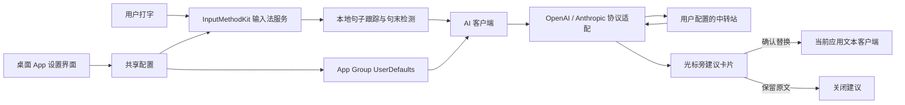

# macOS 桌面英文输入法技术方案设计

- 版本：0.1
- 状态：Xcode 工程、输入法流程原型与未签名 arm64 PKG 已生成；跨应用替换仍待本机验收
- 目标设备：当前 Apple Silicon Mac；首轮仅本人试用
- 产品依据：[产品设计方案.md](产品设计方案.md)

## 1. 技术目标与约束

### 目标

1. 提供可安装的 macOS 桌面 App，包含独立设置/试用界面和系统级英文输入法。
2. 用户打字时，英文与拼音占位词立即像普通键盘一样进入当前应用。
3. 句子完成后异步请求 AI；建议显示在当前输入位置附近，用户确认后替换已输入句子。
4. 支持用户自有中转站，至少兼容 OpenAI 与 Anthropic 两种 API 格式。
5. API Key 仅保存在本机安全存储中，句子正文不写入应用日志或本地历史。

### 关键约束

- 输入法不得等待 AI 响应后才显示用户正在输入的字符。
- AI 故障时保留原文，不自动替换或发送。
- AI 检查每个被判断为完成的英文句子，而不只处理含拼音的句子。
- 原句已写入应用后再显示建议；不把整句话长期留作未提交的输入法组合文本。
- 首版支持当前 Apple Silicon 开发设备；Intel 和其他 macOS 版本暂不承诺。

## 2. 建议总体架构

### 语言、框架与工程结构

### 推荐技术栈

- **主要语言：Swift 6**，App 与输入法共用领域模型和业务逻辑。
- **桌面主界面：SwiftUI**；需要精确控制原生窗口、光标附近建议卡片和文本客户端交互时使用 **AppKit**。
- **系统输入法：Apple InputMethodKit**，以 `IMKServer` 和 `IMKInputController` 接收并处理输入事件。
- **网络请求：Foundation `URLSession` + Swift Concurrency (`async/await`)**，不在键盘事件线程等待 AI。
- **配置与 API Key：App 与输入法共享的 `UserDefaults`**。不使用登录钥匙串，避免输入法进程弹出钥匙串密码框或因 ad-hoc 签名报 `errSecCSBadObjectFormat`。
- **依赖管理：Swift Package Manager**；首版尽量只用 Apple 系统框架，避免 Electron、第三方键盘 hook 和不必要的外部依赖。
- **测试：Swift Testing 或 XCTest** 做核心逻辑单元测试；输入法跨应用行为通过 macOS 集成和手工验收。

### 工程拆分

采用一个 Xcode 工程、两个 macOS App 目标和一个共享 Swift Package：

```text
Lucid.xcodeproj
├── LucidApp/           # SwiftUI 主窗口、设置、试用、安装引导
├── LucidInputMethod/        # InputMethodKit 服务、按键输入、文本范围跟踪、建议卡片
├── Sources/LucidCore/ # 句末状态机、AI 协议适配、数据模型、配置接口
└── Tests/                     # Core 单元测试与协议适配测试
```

桌面 App 与 InputMethodKit 服务是不同运行组件。共享业务逻辑放在 `LucidCore`；服务地址、模型和 API Key 通过同一个 App Group `UserDefaults` 共享，不使用 Keychain。`.pkg` 负责交付；为可靠安装输入法组件，安装器把组件安装到系统 Input Methods 目录，也可由主 App 引导安装到用户级 Input Methods 目录。若签名或 InputMethodKit 生命周期使共享存储不可靠，再评估由 App/XPC helper 统一代理 AI 请求，不在首版预先引入云端后端。

### 架构模式

采用**事件驱动的输入管线 + 显式状态机 + 协议适配器**，不先引入复杂的全局架构框架：

```text
键盘事件
  → 立即提交普通文字
  → 更新当前焦点的句子状态机
  → 句末信号成立后异步调用 AI
  → 校验焦点和原句版本仍有效
  → 显示建议卡片
  → 用户确认后替换已输入句子的准确范围
```

AI 服务通过统一的 `AIProvider` 接口隔离 OpenAI 与 Anthropic 的请求/响应差异；句末检测、提示词、结果校验及文本替换不依赖具体服务商。

### 开发环境前置条件

当前开发机已安装 Xcode 27.0、Swift 6.4 与 macOS 27 SDK。使用 Xcode 工程构建、运行单元测试和本机输入法原型；PKG 构建及签名/公证按发布目标配置。用户安装和使用最终 PKG 不需要 Xcode。

### 系统架构

使用原生 Swift/macOS 组件，避免用网页壳或全局键盘监听替代系统输入法。输入法是主产品能力，主 App 负责配置、试用及安装引导。



### 主要组件

1. **桌面主 App**
   - 技术建议：SwiftUI 主窗口，必要时以 AppKit 提供原生输入法/窗口集成。
   - 提供中转站配置、连通性测试、输入试用和启用引导。
   - 不负责拦截全局键盘事件，不保存句子历史。

2. **输入法服务**
   - 技术建议：macOS `InputMethodKit`，通过 `IMKServer`、`IMKInputController` 接收键盘输入并与当前应用文本客户端交互。
   - 文字按普通输入流程及时提交。
   - 在进程内维护当前文本焦点、句子缓冲、触发状态和建议请求 ID。

3. **句子检测器**
   - 标点、回车触发明确的句子完成信号。
   - 停顿使用可调防抖计时器作为辅助信号；初始值需通过试用调优。
   - 对不完整尾部保持谨慎，例如最后一个 token 可能仍在输入时，不立即重复请求。
   - 请求使用递增 ID；用户继续输入、焦点变化或文本被修改时，过期结果不可替换文本。

4. **AI 客户端与协议适配器**
   - 使用 `URLSession` 异步请求，禁止在键盘事件主线程等待网络。
   - 统一内部接口，再分别序列化/解析 OpenAI 和 Anthropic 格式。
   - 用户设置中选择协议，填写中转站地址、模型名和 API Key。
   - 仅把当前待处理英文句子发送给模型，要求返回修改后的句子及简短修改说明；由界面默认隐藏说明。
   - 对超时、非成功 HTTP 状态、无效 JSON、空响应和模型拒答做结构化错误处理。

5. **建议卡片**
   - 使用不抢焦点的小型原生窗口，锚定当前文本光标附近。
   - 默认显示修改后句子，以及“替换”和“保留原文”；修改解释放在可展开区域。
   - 点击控件不应让输入焦点或目标文本范围丢失。

6. **配置共享与凭证**
   - 普通配置（协议类型、中转站地址、模型名、非敏感偏好）保存在用户级配置存储。
   - API Key 存在 App 与输入法共享的本机设置中，不写入钥匙串，也不放在源码、日志或安装包中。
   - App 与输入法服务使用同一个 App Group `UserDefaults`；输入法只读这份设置，不再访问钥匙串。

## 3. 输入到替换的数据流

1. 输入法服务接收按键并立即把字母写入前台文本框。
2. 本地跟踪本次焦点下尚在编辑的句子范围及文本版本；文本不持久化。
3. 句末检测器依据标点、停顿或回车创建一次待处理任务。
4. AI 客户端异步提交单句请求；其他键盘输入不等待响应。
5. 返回结果后，校验请求仍对应同一应用焦点和未被修改的原句。
6. 若原句仍可安全定位，显示建议卡片；若光标/文本位置已变化或客户端不支持安全定位，不得盲目替换，关闭该建议并保留原文。
7. 用户选择“替换”后，仅替换记录的句子范围；选择“保留原文”则只关闭建议。

## 4. 已确认的协议配置

设置页包含：

- API 协议：OpenAI 兼容 / Anthropic 兼容。
- 中转站 Base URL。
- 模型名称。
- API Key（录入后写入 App 自己的共享设置；界面后续仅显示已配置状态或掩码）。
- “测试连接”与保存状态。

安全约束：远程中转站优先要求 HTTPS；API Key 不得在跨域重定向时转发；日志只记录错误类别、状态码和耗时，不记录请求正文、响应正文或凭证。用户自定义中转站是明确输入，仍须对 URL、证书错误和 HTTP 重定向做安全校验。

## 5. API 请求与模型输出

### 请求内容

- 当前完成的一条英文句子，可能包含拼音占位词。
- 仅提供完成该句任务所需的最少上下文；首版不上传整个输入框或历史句子。
- 明确要求：根据英文上下文识别拼音占位；只补词和修明显语法；保留原意与语气；不添加无关内容。

### 规范化内部结果

```json
{
  "corrected_text": "I want to buy coffee.",
  "changes": [
    { "original": "mai", "replacement": "buy", "reason": "根据 coffee 的上下文补全动词" }
  ],
  "confidence": "high"
}
```

实际解析要适配两种 API 的响应格式，不假定模型一定返回合法 JSON。若解析失败、结果为空或置信度不足，则不执行替换并提供重试/保留原文操作。

## 6. 错误与并发处理

- **网络、密钥或服务错误**：原文保留，显示可重试或继续的提示；不自动替换、不自动发送。
- **用户继续打字**：新输入不被请求阻塞；旧请求结果仅在原文仍存在且未变化时有效。
- **焦点切换**：不把旧应用的建议插入当前新焦点。
- **文本被用户编辑/删除**：旧建议标记过期，不执行替换。
- **文本客户端不支持范围替换**：不降级成全局删除/重输；保留原文并提示无法应用建议。
- **重复句末信号**：同一文本版本只产生一个活动请求；新版本使旧请求失效。

## 7. 隐私与安全

- 句子只在内存中短暂保留，用于句末检测和本次 AI 请求；不写入磁盘、崩溃报告或遥测。
- 请求前说明文本会发送到用户配置的中转站；应用侧不保存输入内容。
- 不能承诺中转站或其上游模型服务不留存数据；其留存规则需由用户在启用前确认。
- 设置中的 API Key 仅用于对应配置的请求；更换/清除服务配置时提供删除 Key 的操作。
- 自定义 URL 限制明文 HTTP（localhost 开发地址除外）；不允许 API Key 被重定向到其他主机。

## 8. 打包与安装

- 主 App 与 InputMethodKit 服务需按 macOS 输入法要求正确打包、注册及共享配置。
- 已有 `scripts/build-dmg.sh` 生成未签名 universal Release `.pkg`；当前仅作为本机测试产物，正式发布仍需 Developer ID 签名及公证。
- 对外发布时使用 Developer ID 签名及公证，降低 Gatekeeper 安装阻碍。
- 首次启动引导用户在 macOS 键盘设置中启用输入法；系统限制下不假设 App 可以静默替用户开启。
- 当前产物针对 Apple Silicon；是否扩展 Universal Binary 在核心闭环验证后再定。

## 9. 验证计划

### P0 技术验证：已提交文本的可靠替换

这是最高风险，先做小型 InputMethodKit 原型，不先开发完整 UI。

- 验证输入字符是否可立即提交并在前台显示。
- 验证能否读取/维护句子范围，并仅替换前台文本框中的目标句子。
- 覆盖原生文本框、浏览器文本框和微信；微信作为首个重点聊天场景，验证输入、回车发送和原句替换。
- 验证句子处理期间继续输入、切换窗口、移动光标、文本被修改等情况不会导致错误替换。
- 验证聊天回车拦截和错误恢复行为。
- 替换完全走 macOS 输入法接口（IMKTextInput）的 marked text 叠加层与 insertText，不使用 Accessibility 辅助功能或合成键盘事件；宿主忽略范围时必须读回校验，禁止追加导致原文重复。

### 组件测试

- 句末检测：标点、回车、停顿、重复触发、未完成短语。
- API 适配：OpenAI/Anthropic 成功响应、错误响应、超时、异常响应格式。
- 结果校验：空文本、过长文本、非法字符和不确定结果不会触发替换。
- 安全：Key 不进入日志、配置明文或源码；跨主机重定向不泄露凭证。

### 手工验收

以 TextEdit、浏览器文本框和目标聊天应用验证：输入延迟、卡片位置、替换精度、回车行为及焦点切换安全。

## 10. 技术决策与待验证项

### 已与用户对齐

- 语言与框架：Swift 6、SwiftUI/AppKit、Apple InputMethodKit、Foundation URLSession/Swift Concurrency、UserDefaults、Swift Package Manager。
- 工程结构：一个 Xcode 工程，包含桌面主 App、InputMethodKit 服务及共享 Swift 核心模块。
- 输入法打字时立即显示普通文本；AI 在句子结束后异步提出建议。
- 每个完成的英文句子都进行 AI 检查。
- 用户确认后替换；保留原文不修改。
- 支持用户中转站的 OpenAI 与 Anthropic 兼容协议。
- 中转站地址、模型和 Key 在设置中配置；Key 存在 App 自己的共享设置里。
- AI 失败时保留原文、提供重试/继续，不自动替换或发送。
- 建议显示在光标附近的小卡片中。
- 首轮只支持当前 Apple Silicon Mac。

### 最高风险待验证

- InputMethodKit 是否能在目标应用中稳定定位并替换已提交的句子，而不要求用户等待或授予过度权限。
- 输入法服务与主 App 的安装注册、共享设置是否能以签名安装包稳定工作。
- 不同聊天软件对回车、发送和文本范围替换的差异。

若 P0 验证失败，应先向用户报告具体平台限制并共同调整支持范围或交互，不应静默改成需要用户等待输入法组合提交的体验。
